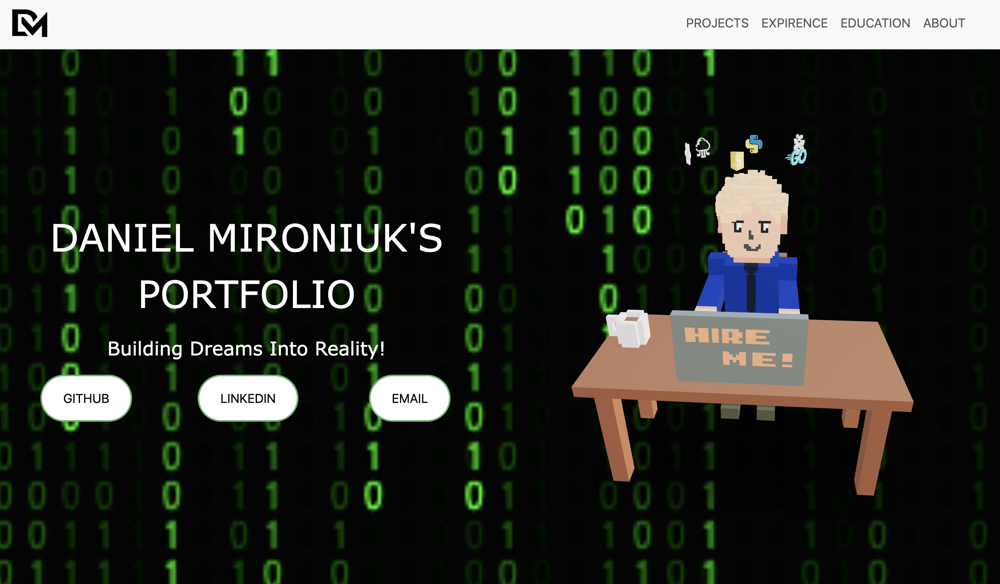

<a name="readme-top"></a>

[](https://GitHub.com/Naereen/StrapDown.js/graphs/commit-activity)


<!-- TABLE OF CONTENTS -->
<details>
  <summary>Table of Contents</summary>
  <ol>
    <li>
      <a href="#about-the-project">About The Project</a>
      <ul>
        <li><a href="#built-with">Built With</a></li>
      </ul>
    </li>
    <li>
      <a href="#getting-started">Getting Started</a>
      <ul>
        <li><a href="#prerequisites">Prerequisites</a></li>
      </ul>
    </li>
    <li><<a href="#installation">Installation</a></li>
  </ol>
</details>


<!-- ABOUT THE PROJECT -->
## Daniel Mironiuk's Porfolio



This project is a React application of my software personal portfolio which consolidates my credentials, expirence, education and project demos. You can check out the published website at: "http://softwarebydanielmironiuk.com/"


<p align="right">(<a href="#readme-top">back to top</a>)</p>


### Built With

Languages:
* Javascript
* CSS

Frameworks:
* React
* React-Bootstrap

Libraries:
* three.js

<p align="right">(<a href="#readme-top">back to top</a>)</p>


<!-- GETTING STARTED -->
## Getting Started

Make sure to have `npm install` packages configured and to have `threejs` and `react-bootstrap` configured. Then just run `npm start`

### Installation

1. Clone the repo
  ```sh
  git clone https://github.com/dnnysoftware/Daniel-Mironiuks-Portfolio.git
  ```
2. Make sure to have dependencies installed
3. Start the application
  ```sh
  npm start
  ```

<p align="right">(<a href="#readme-top">back to top</a>)</p>